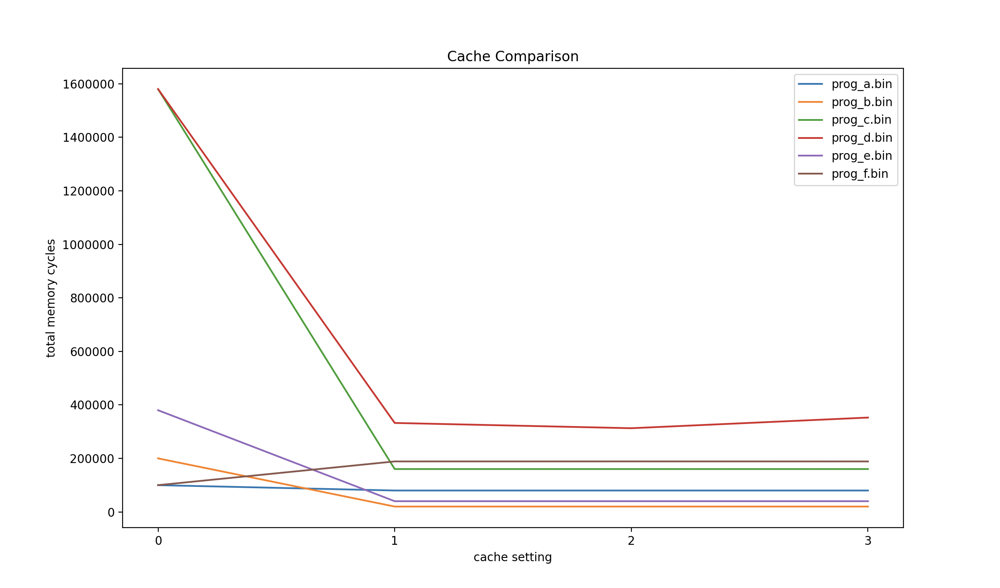
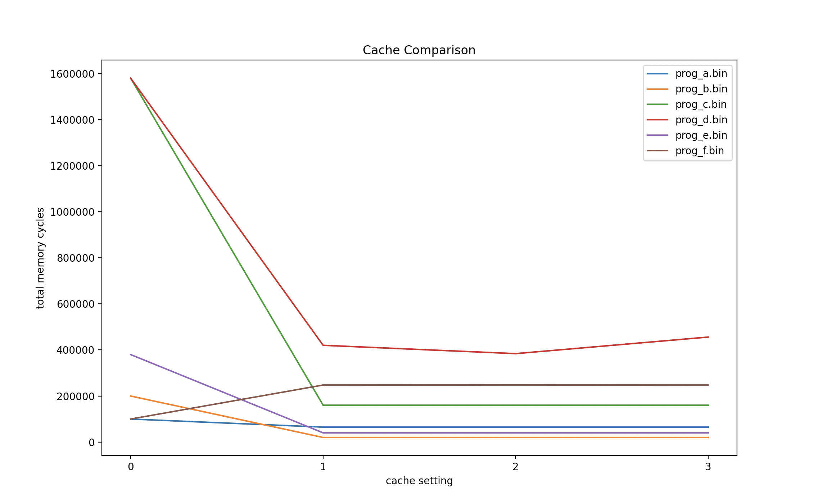

# Project 3 Write Up
Jonah Cragun

CS4380

## Part 5

### Graph and Table

| File Name    |   No Cache |   Direct Mapped |   Fully Associative |   2-Way Set Associative |
|:-------------|-----------:|----------------:|--------------------:|------------------------:|
| prog\_a.bin  |     100030 |           80031 |               80031 |                   80031 |
| prog\_b.bin  |     200040 |           20060 |               20060 |                   20060 |
| prog\_c.bin  |    1580130 |          160224 |              160224 |                  160224 |
| prog\_d.bin  |    1580130 |          332490 |              312822 |                  352568 |
| prog\_e.bin  |     380030 |           40059 |               40059 |                   40059 |
| prog\_f.bin  |     100010 |          188691 |              188777 |                  188655 |

### Analysis
Looking at the results generated in the graph and table above, we see the number of memory cycles each type of cache took to execute various programs. Regarding program a, we see that no cache took significantly longer than any of the 3 caches. Since instructions are stored sequentially in memory, the caches are able to take advantage of spacial locality and every block that is loaded in to each cache line is being used in most cases, causing them to use fewer clock cycles. We also notice that all 3 caches produce the same results. This can be explained as each cache type has the same number of cache lines (64), and since the program is so large, each cache line is being filled. Once all of the cache lines are filled, if a new memory location is encountered, it will need to over write a cache line. Since our program moves in a sequential order, direct mapped will load in a new cache line sequentially until the cache is full without over writing any lines. Once the cache is full, it will encounter a memory location that overlaps with the first location in memory and over write it. The fully associative cache will do the exact same thing as the direct mapped cache, just for different reasons. It will fill each cache line with memory in order until the cache line is full. Once the cache is full, it will replace the least recently used cache line, from top to bottom until it reaches the bottom again where it will start over. The 2-way set associative cache will also perform in the exact same way. It is different in that it has 32 sets with 2 cache lines each, the lines of memory read in are sequential, so 2 lines of memory next to each other will be read into the same set. This means that the first 2 lines will be read into the first set in consecutive order, then the second 2 lines will be read into the second set and so on until each cache line within the 32 sets are full. It will then start at the first set of the cache similar to the other 2 cache methods and continue moving top to bottom. 

Looking at program b, we see that the when the program is run without a cache it performs almost twice as bad, but when using any of the caches it performs almost 4 times better. The program is performing the same operations as program a, but it is put inside of a loop instead of repeating the line 10000 times manually. Because of the overhead of using a loop and using the bnz instruction, there are 2 instructions that need to run for every 1 instruction in program a, making the use of the no cache option much worse. Since the instructions in the loop are always at the same memory address, once they are loaded into the caches the first time, it will only increment the clock by 2 cycles each time it loops which greatly reduces the amount times memory needs to be accessed by the caches.

Looking at program e, we see it is the same as program b, with the change that inside of the loop it performs and ILDB operation in addition to the SUB operation. This ILDB causes the program to have twice as many memory accesses which we see is reflected in the results for all versions of the caches.

Looking at programs c and d, we see that the only difference is program c uses the instruction ILDB, while program d uses the instruction ILDR. As we can see, when no cache is used, the programs produce the same results as the programs are nearly identical and have the same amount of memory access instructions. The caches however perform better in program c compared to d. This is because the memory access function in program c (ILDB) reads a byte from a memory location while the memory access function in program d (ILDR) read a word (4 bytes) from a memory location. The programs have loops that repeat 1000 times and generate a new memory location to load data from with each iteration. With memory access jumping around, and reading in 4 bytes at once in the case of program d, it will sometimes need to read in bytes that span 2 cache lines. When this happens almost twice as many clock cycles are required for the operation compared to reading in a single byte.

Looking at program f, we see that there are about 10000 lines of memory being loaded in, all of which are jump instructions. These jump instructions move all throughout the program seemingly randomly. Taking a look at the results for each cache, we see that the caches actually perform worse than having no cache. This is because the program is jumping outside of the range of each cache line and causing the program to read from memory and in some cases over write cache lines before we are able to take advantage of spacial locality.

## Part 6

### Graph and Table

| File Name |   No Cache |   Direct Mapped |   Fully Associative |   2-Way Set Associative |
|:----------|-----------:|----------------:|--------------------:|------------------------:|
| prog\_a   |     100030 |           65025 |               65025 |                   65025 |
| prog\_b   |     200040 |           20048 |               20048 |                   20048 |
| prog\_c   |    1580130 |          160190 |              160190 |                  160190 |
| prog\_d   |    1580130 |          420138 |              384068 |                  455912 |
| prog\_e   |     380030 |           40047 |               40047 |                   40047 |
| prog\_f   |     100010 |          247759 |              247999 |                  247733 |

### Analysis
When decreasing the number of cache lines to 32 and increasing the block size to 32, we get the above results when running the same programs. We see very similar results in the way the caches behave. When using no cache, the results are obviously the same. In the case of each cache we see that they follow the same patterns as before. In some cases the caches have the same number of cycles as each other for a given program due to reasons explained in part 5. We also see the same trends between programs a, b, and e as in part 5. The correlation between programs c and d also follows the same pattern as in part 5. We also see that program f behaves the same as would be expected from looking at part 5.

It is interesting to see that our cache from part 6 performs significantly better than our cache in part 5 in regards to program a. This is because all of the memory being read is from instruction fetches and is grabbed in sequential order. Since our block size in part 6 is larger, we are able to read in more memory at a time and in most cases all of the blocks are used before needing to read in more memory. Since it takes fewer clock cycles to read in more memory at a time and we are using almost all of the memory we read into the cache, we get a significant speed up.

Looking at programs b, c and e, we see that they perform very similarly to the results produced in part 5. This is because all of these programs contain very few instructions that need to be fetched from memory, which when loaded into the cache are rarely over written. This means that after loading a line into the cache, we would expect the same performance from each cache in both parts.

Looking at program d, we see that all of the caches perform worse when compared to part 5. This is because when the ILDR instruction is being called and a word spans 2 cache lines, the cache has too read much more memory at a time to accommodate a single memory access when compared to part 5. Our cache in part 6 also has fewer lines and when memory accesses are are not consecutive, the chances of something needing to be overwritten are higher.

Looking at program f, we see that all of the caches perform worse when compared to part 5. This program is jumping all over unpredictably and reading memory at locations that are far apart which makes it impossible for the caches to take advantage of spacial locality. Since the caches in part 6 are reading 32 blocks at a time and most of the blocks are not being used, it is wasting more memory than part 5, which causes it to perform worse.

The differences in the cache performance seems to come down to program 6 attempting to better take advantage of spacial locality at the cost of some more overhead for reading in a cache line. In programs where there is a large amount of sequential memory access we see a general speed up. However, in the case where accesses are less predictable and jump all over, we see worse performance due to the extra over head and the inability to use spacial locality.
